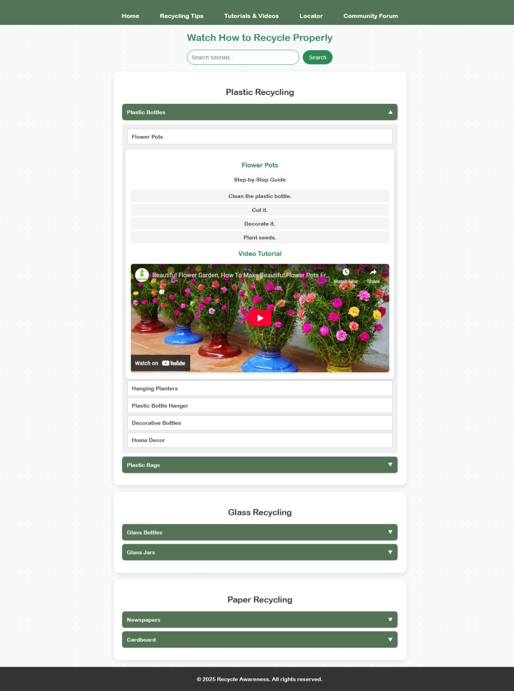
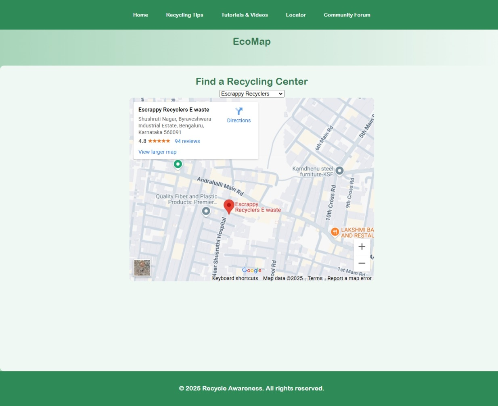
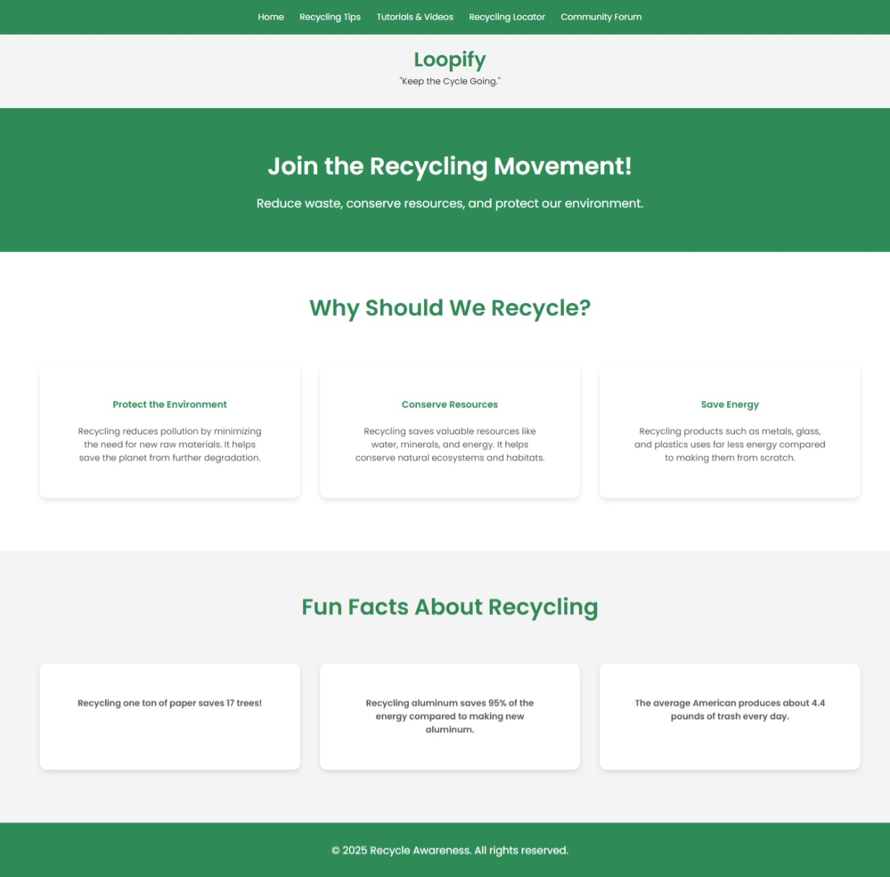

# ♻️ Loopify

**Loopify** is a sustainability-focused web platform developed within 24 hours during the **TakeDown 2025 Hackathon**. It empowers individuals to adopt eco-friendly practices through **location-based recycling help**, **green living tips**, and a **community forum** to exchange knowledge and ideas.

---

## 🌟 Features

- 🔍 **Locate Recyclers**: Find nearby recycling centers using our interactive locator.
- 📚 **Eco Tips**: Access categorized sustainability advice for everyday life.
- 🧠 **Tutorials**: Learn how to reduce, reuse, and recycle with step-by-step guides.
- 💬 **Forum**: Join the community and discuss eco-initiatives or share tips.
- 🔐 **Login System**: Simple and secure user sign-in/sign-up flow.

---

## 🖼️ Project Preview

> Home Page  

> Forum Interface  

> Tips Section  

---

## 🛠️ Tech Stack

- **Frontend**: HTML, CSS, JavaScript
- **Design**: Canva, Figma (for planning)
- **Assets**: Royalty-free images/icons

---

## 🚀 Future Improvements

- Add database support for storing forum data and user profiles.
- Integrate real-time location services for recycler locator.
- Include gamification elements to reward eco-friendly activities.
- Enable post sharing and voting in the forum.

---

## 🤝 Team

Made  at **TakeDown 2025** with a passionate team in just 24 hours.

---

